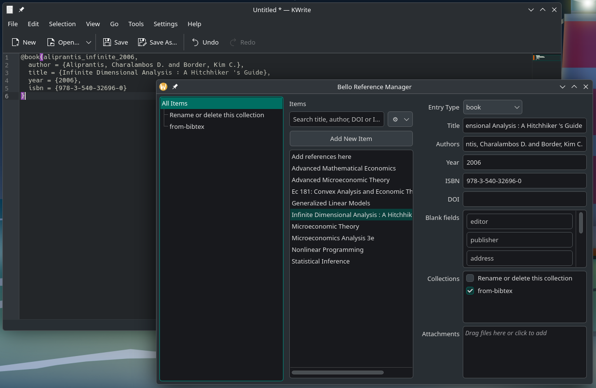

# Bello — A Lightweight Reference Manager

This folder contains Bello, a minimal reference manager similar to Zotero's core functionality.

Why 'Bello'? As a tribute to [Andres Bello](https://en.wikipedia.org/wiki/Andr%C3%A9s_Bello), a Venezuelan-Chilean poet, jurist, philologist, and educator who made significant contributions to Latin American literature and legal systems. He also led the creation of the University of Chile in 1842.

The software is much faster than Zotero because it uses DuckDB instead of SQLite, and Qt instead of Electron. This is not a fork, but a separate project that aims to provide a minimal reference manager with local-only storage and native performance.

I made this because with my arthritis I sent a PR to Zotero that allowed me to copy Bibtex entries to clipboard, but it was rejected after they told me that "quick copy" is for that (it is not the same, I proposed an ergonomic way).

I built a connector for Firefox/Chrome that needs extra testing it will be publicly available soon.



If this software is useful to you, consider buying me a coffee:

[](https://buymeacoffee.com/pacha/e/414420)

## Features

- Local-first: No cloud sync, all data stored locally in DuckDB
- Native performance: Qt6 application instead of web technologies  
- File management: Opens PDFs and attachments in system default applications
- Browser integration: Compatible connector
- Cross-platform: Linux, macOS, Windows support
- Slightly better organization: Exports entries as `doi/files`, `isbn/files` or `authoryear/files` as a fallback instead of `123/files` (Zotero style)
- Bibtex centred: Provides clipboard export of Bibtex entries for easy pasting into Rmd/Qmd/LaTeX documents

## Shortcuts

Use Cmd instead of Ctrl on macOS.

* `Ctrl+Shift+A`: Add collection
* `Ctrl+Shift+S`: Add subcollection
* `Ctrl+Shift+I`: Import from file (bib, rdf, xml)
* `Ctrl+C`: Copy selected items to clipboard
* `Ctrl+Shift+C`: Copy Bibtex entry of selected items to clipboard

## Installing

## Binaries

Bello GUI:

* [Ubuntu](https://github.com/pachadotdev/bello/releases/download/v1.0.0/bello_1.0.0_amd64.deb)
* [Windows](https://github.com/pachadotdev/bello/releases/download/v1.0.0/bello-1.0.0-windows-x64.exe)
* macOS - for some reason GitHub Actions does not start the macOS runners, please wait a bit or build from source.

Browser extensions:

* [Firefox](https://github.com/pachadotdev/bello/releases/download/v1.0.0/bello-connector.xpi)

## Build from source

To build on Unix-based systems, like Linux or macOS, you need the build tools and  Qt6 installed.

Here is what I did on Manjaro:

```bash
sudo pacman -S --needed base-devel
sudo pacman -S qt6-base qtcreator cmake ninja
```

```bash
./build.sh --install
```

## Testing

1) Test build with CMake (*):

```bash
rm -rf build
./build.sh
```

2) Test the connector

```bash
npx --yes web-ext run --source-dir connector --verbose
```

(*) The script will download and use the following DuckDB binaries:

* Linux on AMD64: https://github.com/duckdb/duckdb/releases/download/v1.4.3/libduckdb-linux-amd64.zip
* Linux on Snapdragon: https://github.com/duckdb/duckdb/releases/download/v1.4.3/libduckdb-linux-arm64.zip
* Windows on AMD64: https://github.com/duckdb/duckdb/releases/download/v1.4.3/libduckdb-windows-amd64.zip
* Windows on Snapdragon: https://github.com/duckdb/duckdb/releases/download/v1.4.3/libduckdb-windows-arm64.zip
* macOS: https://github.com/duckdb/duckdb/releases/download/v1.4.3/libduckdb-osx-universal.zip
